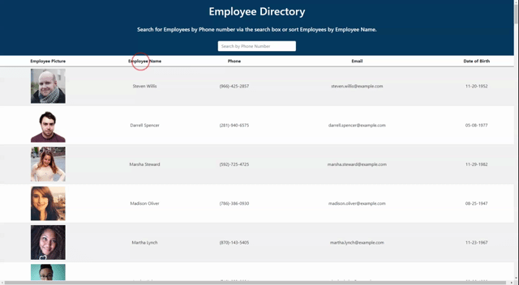

# Employee-Directory

## Description

This is an application that allows for users to view the entire company directory and search for specific employees via their Name, or phone number quickly.

- [Description](#description)
- [User Story](#user-story)
- [Business Context](#business-context)
- [Acceptance Criteria](#acceptance-criteria)
- [Installation](#installation)
- [Usage](#usage)

## User Story

- As a user, I want to be able to view my entire employee directory at once so that I have quick access to their information.

## Business Context

An employee or manager would benefit greatly from being able to view non-sensitive data about other employees. It would be particularly helpful to be able to filter employees by name.

## Acceptance Criteria

Given a table of random users generated from the [Random User API](https://randomuser.me/), when the user loads the page, a table of employees should render.

The user should be able to:

- Sort the table by at least one category

- Filter the users by at least one property.

## Installation

There is no installation required for this application as it is hosted on gh-pages. This is the link to the [Employee Directory Application](https://ntch2000.github.io/employee-directory/).

To view the project files please visit my [GitHub Repository](https://github.com/ntch2000/employee-directory).

## Usage

To utilize this application, go to the application link provided to view the main page. This page will load a table of random user employees from the [Random User API](https://randomuser.me/).

Users can then sort the table of employees in either ascending or descending order by clicking on the "Employee Name" field. Users can also search for employees by their phone number by typing the numbers in the search box at the top of the page.

Please see the GIF for a demonstration of the application.

_Gif of using the Employee Directory application_

---

© 2021 Neil Gandhi
